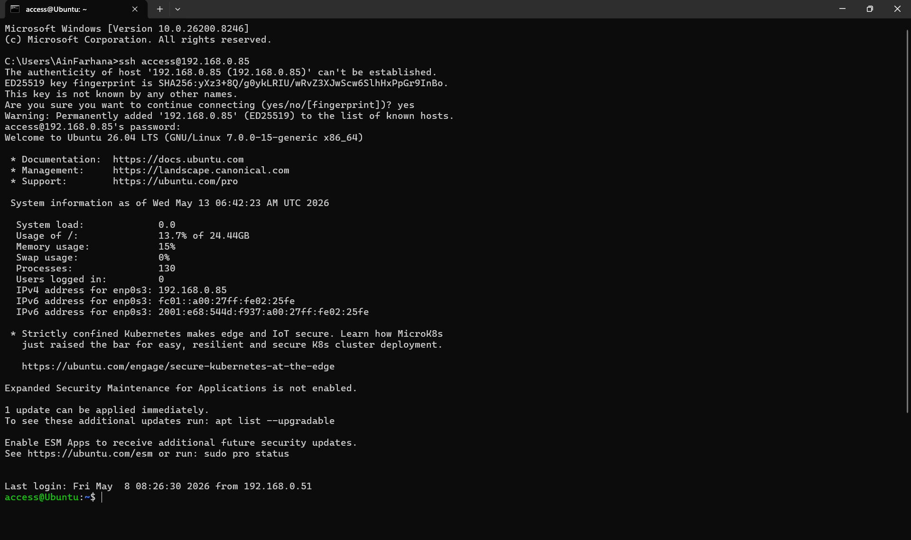

# Basic Configuration

Running a Ubuntu Server 26.04 on Oracle Virtual Box

To check network interfaces

```bash
ip a
```

To install openssh server
```bash
sudo apt install openssh-server -y
sudo systemctl enable --now ssh
```

To enable Uncomplicated Firewall (UFW)
```bash
sudo ufw allow ssh
```

Access the server using other device using ssh
